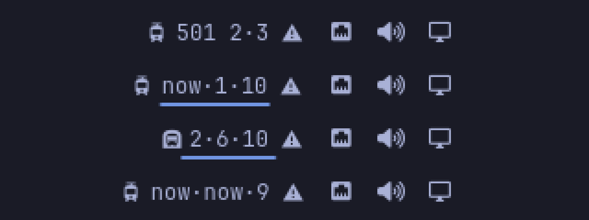
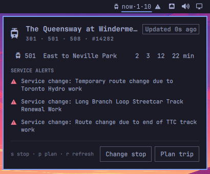
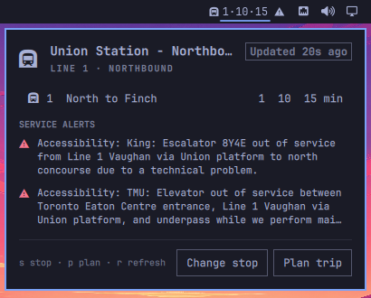
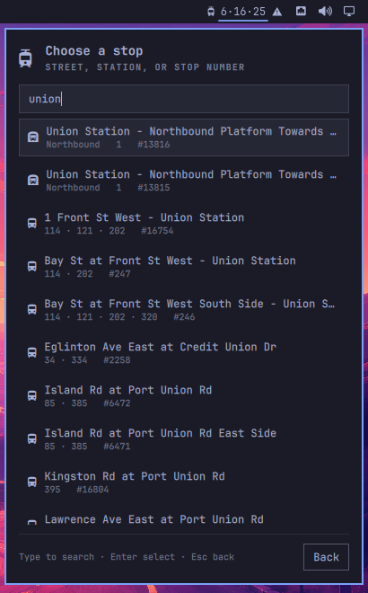
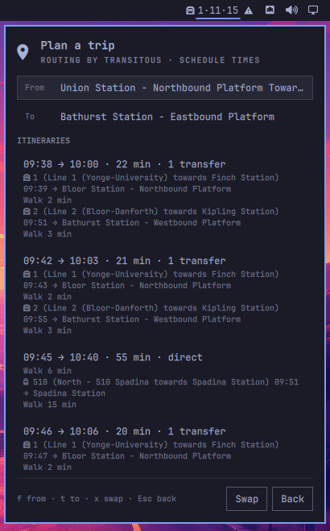
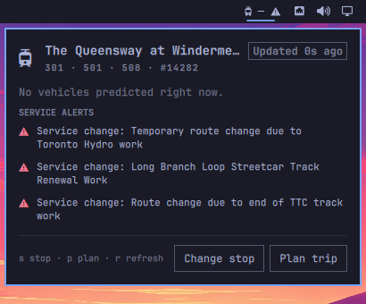
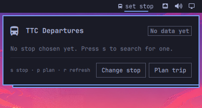

# TTC Departures for Omarchy

Live TTC arrivals for your stop in the Omarchy bar, with a panel for the full board, service alerts, a stop picker, and a trip planner. Buses, streetcars, and subway Lines 1, 2, and 4 are covered in real time. No API keys, no accounts.

<p align="center"></p>

Top to bottom: the "Route and minutes" label, a streetcar stop with an active alert, a Line 1 platform, and the plain "Minutes" label with three arrivals. On a bar docked to the left or right the label stacks one value per line:

<p align="center"></p> Every screenshot in this README was taken on a real Omarchy 4.0.4 desktop by the repository's VM test.

- **Hover** the bar for the board: every route at the stop, direction, next arrivals, alerts.
- **Click** to open the panel.
- **Right-click** to send the board as a desktop notification.
- **Middle-click** to refresh now.

In the panel: `s` searches for a new stop, `p` plans a trip, `r` refreshes, arrows or `j`/`k` move, `Enter` selects, `Esc` goes back and then closes.

## Install

```
omarchy plugin add https://github.com/MehrshadFb/omarchy-ttc-departures.git --enable
```

Click the widget, press `s`, and type your stop: a cross street, a station name, or the stop number printed on the pole. That is the whole setup. The choice is saved in your shell configuration.

You can also configure it from the command line:

```
omarchy bar put io.github.mehrshadfb.ttc-departures right
omarchy bar set io.github.mehrshadfb.ttc-departures stopId 14282 --json
```

Or by route and a few words of the stop name, which the widget resolves for you:

```
omarchy bar set io.github.mehrshadfb.ttc-departures route 501
omarchy bar set io.github.mehrshadfb.ttc-departures stop "Windermere east"
```

The widget shows one stop at a time; switch stops from the panel in two keystrokes. Watching several stops at once is on the roadmap.

## The panel

<table>
<tr>
<td align="center"><br><sub>Board and alerts</sub></td>
<td align="center"><br><sub>A subway platform, live</sub></td>
</tr>
<tr>
<td align="center"><br><sub>Stop picker</sub></td>
<td align="center"><br><sub>Trip planner</sub></td>
</tr>
<tr>
<td align="center"><br><sub>Nothing coming: a night route filtered during the day</sub></td>
<td align="center"><br><sub>Fresh install, no stop yet</sub></td>
</tr>
</table>

**Board.** One row per route and direction with the next arrivals, recomputed from the feed's absolute times as the clock runs. Vehicles that end before the terminus are marked with `*` (a short turn). Active alerts for the stop and its routes appear underneath.

**Stop picker.** Searches the shipped list of every TTC stop and subway platform. Subway platforms rank first for station names, so "union" offers Union Station's platforms before the bus bays outside. Picking a stop writes it to your shell configuration immediately.

**Trip planner.** Choose From and To stops, and the panel shows up to four itineraries with times, transfers, and legs. From defaults to the widget's stop. Routing comes from [Transitous](https://transitous.org), a community-run router built on the TTC's published schedule, so itinerary times are scheduled times. Real-time predictions apply to the departures board, not to itineraries.

## Settings

| Key | Default | Meaning |
|---|---|---|
| `stopId` | `0` | The stop number. The picker sets this for you. |
| `route`, `stop` | `""` | Alternative to `stopId`: a route number and a few words of the stop name. |
| `routes` | `""` | Comma-separated routes to show, for example `501,301`. Blank shows every route at the stop. |
| `maxShown` | `2` | Arrivals in the bar label, 1 to 4. |
| `refreshSeconds` | `30` | Poll interval, minimum 15. |
| `labelStyle` | `Minutes` | `Minutes` shows `5·15`. `Route and minutes` shows `501 5·15`. |

Settings live inline in the widget's entry in `~/.config/omarchy/shell.json`, which is how `omarchy bar set` writes them:

```json
{ "id": "io.github.mehrshadfb.ttc-departures", "stopId": 14282, "maxShown": 3 }
```

## How it works

A Python 3 helper, `ttc.py`, is run by the widget with an argument list, never through a shell, and prints one JSON document per request. It uses only the standard library and decodes the GTFS-realtime protobuf feeds with a small built-in reader, so nothing needs to be installed. One shared hub inside the shell runs the helper once per stop on a schedule, however many bars or widgets show that stop.

`data/stops.json` and `data/trips.json` are built from the TTC's published GTFS by `tools/build_stops.py`. They carry every stop and platform, which routes serve it, the internal id the BusTime feed uses for it, the direction each route serves at each stop, and the headsign of every scheduled trip. The live feed carries a trip id and a window of stops but no destination, so those tables are what let the widget say "East to Neville Park" and mark a short turn.

## Data sources and attribution

| Source | Used for |
|---|---|
| [TTC Routes and Schedules](https://open.toronto.ca/dataset/ttc-routes-and-schedules/) and [Surface Routes and Schedules for BusTime](https://open.toronto.ca/dataset/surface-routes-and-schedules-for-bustime/) (GTFS, Toronto Open Data) | The shipped stop table |
| [TTC BusTime GTFS-realtime](https://open.toronto.ca/dataset/ttc-bustime-real-time-next-vehicle-arrival-nvas/) | Bus and streetcar arrivals and occupancy |
| [TTC GTFS-realtime](https://gtfsrt.ttc.ca) | Subway arrivals and service alerts |
| Legacy NextBus feed | Fallback only, when BusTime returns nothing for a stop |
| [Transitous](https://transitous.org/sources/) | Trip planning |

Contains information licensed under the [Open Government Licence – Toronto](https://open.toronto.ca/open-data-licence/). Routing by Transitous; see [their data sources](https://transitous.org/sources/). This project is not affiliated with, endorsed by, or an official application of the Toronto Transit Commission or the City of Toronto.

## Network access and privacy

The plugin has no analytics or telemetry. Your chosen stops are stored locally in your Omarchy shell configuration. Feed responses are cached under `~/.local/state/omarchy/ttc-departures/` for a few seconds so the bar and the panel share one download, and a cached copy up to 15 minutes old stands in when a feed is briefly unreachable.

| Host | When | What it learns |
|---|---|---|
| `bustime.ttc.ca`, `gtfsrt.ttc.ca` | Every refresh | Your IP address. These are city-wide feeds, so your stop is not sent. |
| `retro.umoiq.com` | Only when BusTime has nothing for your stop | Your IP address and the stop number. |
| `api.transitous.org` | Only when you plan a trip | Your IP address, the two stops' coordinates, and a User-Agent naming this plugin. |

## Remove

```
omarchy plugin remove io.github.mehrshadfb.ttc-departures
```

To also delete the small feed cache:

```
rm -rf ~/.local/state/omarchy/ttc-departures
```

## Development

```
./test/all               # Node tests for Model.js, Python tests for ttc.py, syntax checks
omarchy plugin validate . 
python3 ttc.py departures 14282 | jq .
python3 ttc.py search union station | jq .
python3 ttc.py plan 13760 13816 | jq .
```

The Python tests validate the protobuf reader against the TTC's own text renderings of the same feeds, saved under `test/fixtures/rt`, and exercise departures merging, the NextBus fallback, alert matching, search ranking, and itinerary parsing offline.

`tools/build_stops.py` regenerates `data/stops.json` and `data/trips.json`. The TTC publishes a new schedule roughly every six weeks; the `refresh-stops` workflow rebuilds the table weekly and opens a pull request when it changes.

The `vm-test` workflow installs Omarchy from the official ISO in a KVM guest on a GitHub runner, installs this plugin inside it, drives the bar, picker, and planner with keystrokes, and uploads screenshots. Trigger it from the Actions tab; it takes about an hour.

## License

MIT. Transit data is subject to the licences named above.
